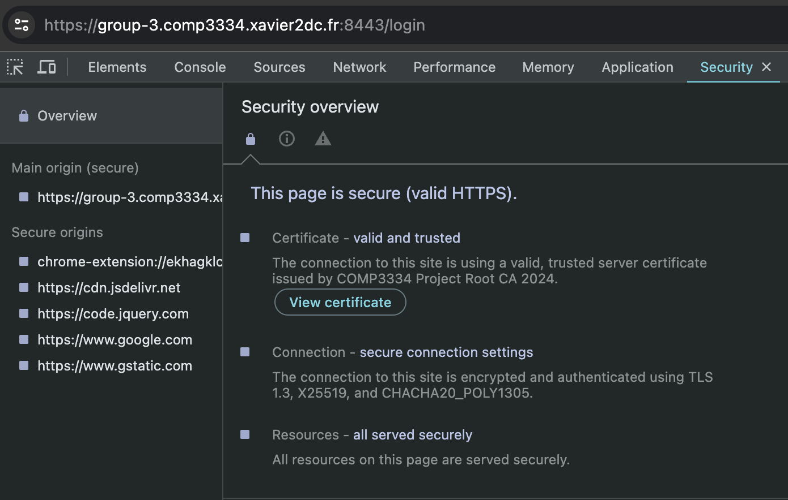
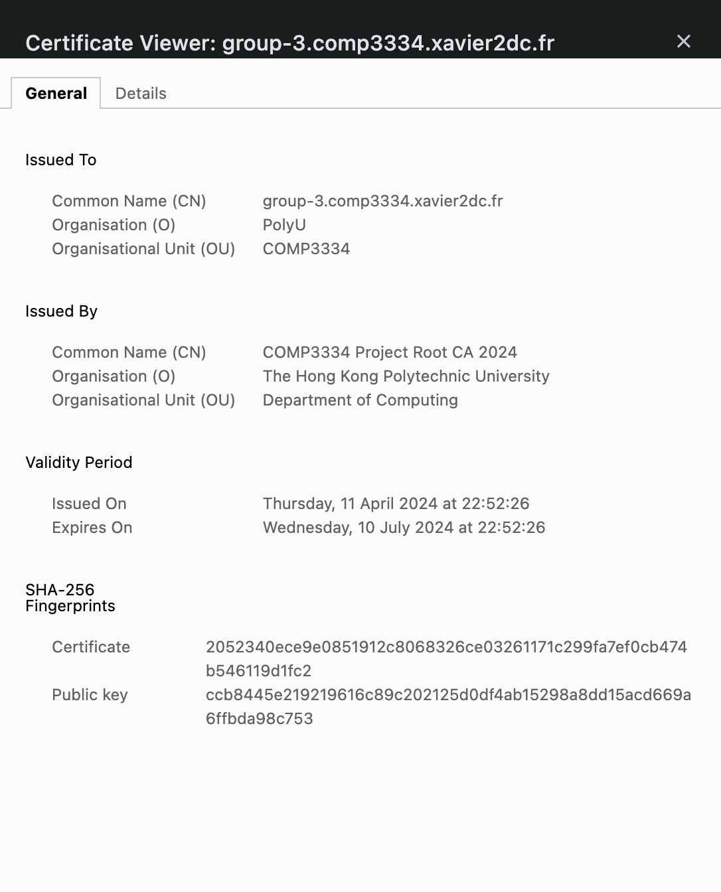

&nbsp;
&nbsp;
&nbsp;
&nbsp;
&nbsp;
&nbsp;
&nbsp;
&nbsp;
&nbsp;
&nbsp;
&nbsp;

<center>

### The Hong Kong Polytechnic University 
### Department of Computing
&nbsp;
&nbsp;
&nbsp;
### COMP3334 Computer Systems Security
#### Lecturer: Dr. Xavier de Carné de Carnavalet
### End-to-end Encrypted (E2EE) Chat Web Application
## Project Report
</center>

&nbsp;
&nbsp;
&nbsp;

<center>
Group 3
</center>

<center>
LIU Minghao (21096308d)
<br>
YE Haowen (21098829d) 
<br>
ZHANG Wengyu (21098431d)
</center>

<center>
April 2024
</center>

<div style="page-break-after: always;"></div>

### 1. Introduction

We believe privacy and security is very important in nowadays online social connections. In this project, we implement a End-to-end Encrypted (E2EE) Chat Web Application, which provides a comprehensive authentication, end-to-end encryption, and a secure channel for users to communicate online. The application is hosted at `https://group-3.comp3334.xavier2dc.fr:8443/`.


### 2. List of Requirements Implemented

#### 2.1 Authentication Requirements Implemented

All of the requirements are implemented.

No. | Section | Requirement | NIST Section | Details
:-: | :-: | --- | :-: | ---
|| **Authenticators:** |
1 || User-chosen Memorized Secret | $\S$ 5.1.1 Memorized Secrets | 1. Memorized secrets SHALL be at least 8 characters in length when chosen by the subscriber <br> 2. Choose “Passwords obtained from previous breach corpuses” and refer to `https://haveibeenpwned.com/API/v3#PwnedPasswords` for the corpus to check against ($\S$ 5.1.1.2) <br> 3. "Memorized secrets SHALL be salted and hashed using a suitable one-way key derivation function" ($\S$ 5.1.1.2) <br> 4. Memorized secret verifiers SHALL NOT permit the subscriber to store a “hint” that is accessible to an unauthenticated claimant <br> 5. Verifiers SHOULD offer an option to display the secret <br> 6. Verifiers SHOULD offer guidance to the subscriber <br> 7. Verifiers SHOULD permit claimants to use “paste” functionality when entering a memorized secret <br> 8. The verifier SHALL use approved encryption and an authenticated protected channel when requesting memorized secrets in order to provide resistance to eavesdropping and MitM attacks
2 || Single-Factor OTP Device | $\S$ 5.1.4 Single-Factor OTP Device | 1. The secret key and its algorithm SHALL provide at least the minimum security strength specified in the latest revision of SP 800-131A (112 bits as of the date of this publication). <br> 2. The nonce SHALL be of sufficient length to ensure that it is unique for each operation of the device over its lifetime. ($\S$ 5.1.4.1) <br> 3. Time-based OTPs [RFC 6238] SHALL have a defined lifetime that is determined by the expected clock drift — in either direction — of the authenticator over its lifetime, plus allowance for network delay and user entry of the time-based OTP. <br> 4. In order to provide replay resistance as described in Section 5.2.8, verifiers SHALL accept a given time-based OTP only once during the validity period.
3 || Look-Up Secret | $\S$ 5.1.2 Look-Up Secrets | 1. Look-up secrets having at least 112 bits of entropy SHALL be hashed with an approved one-way function <br> 2. Look-up secrets SHALL have at least 20 bits of entropy <br> 3. The salt value SHALL be at least 32 in bits in length and arbitrarily chosen so as to minimize salt value collisions among stored hashes <br> 4.  Look-up secrets SHALL be distributed over a secure channel in accordance with the post-enrollment binding requirements <br> 5. Both the salt value and the resulting hash SHALL be stored for each look-up secret
4 || Replay Resistance and Authentication Intent are automatically complied  | $\S$ 4.2.2 Authenticator and Verifier Requirements | 1. Cryptographic devices that require user action (e.g., pushing a button or reinsertion) for each authentication or reauthentication operation are also establish intent <br> 2. Memorized secrets are not considered replay resistant because the authenticator output is provided for each authentication
|| **Rate-limiting Mechanisms, Image-based CAPTCHAs:**
5 || Implement rate-limiting mechanisms AND image-based CAPTCHAs | $\S$ 5.2.2 Rate Limiting | 1. The verifier SHALL implement controls to protect against online guessing attacks. Unless otherwise specified in the description of a given authenticator. <br> 2. The verifier SHALL limit consecutive failed authentication attempts on a single account to no more than 100. <br> 3. Requiring the claimant to complete a CAPTCHA before attempting authentication.
6 | **Account registration, Bind Authenticators** |||Implement new account registration and bind authenticators (time-based OTP and recovery keys) at the same time, Optional: provide a way to change authenticators after account registration 
|| **Proper Session Binding:**
7 || Implement proper session binding requirements | $\S$ 7.1 Session Bindings | Secrets used for session binding: <br> 1. SHALL be generated by an approved random bit generator [SP 800-90Ar1] and contain at least 64 bits of entropy. <br> 2. SHALL be erased or invalidated by the session subject when the subscriber logs out. <br> 3. SHOULD be erased on the subscriber endpoint when the user logs out or when the secret is deemed to have expired. <br> 4. SHOULD NOT be placed in insecure locations such as HTML5 Local Storage due to the potential exposure of local storage to cross-site scripting (XSS) attacks. <br> 5. SHALL be sent to and received from the device using an authenticated protected channel. <br> 6. SHALL time out and not be accepted after the times specified in Sections 4.1.4, 4.2.4, and 4.3.4, as appropriate for the AAL. <br> 7. SHALL NOT be available to insecure communications between the host and subscriber’s endpoint.
|| **Autonomy and Creativity:**
8 || Automatically logout | $\S$ 4.3.3 Reauthentication | 1. Authentication of the subscriber SHALL be repeated at least once per 12 hours during an extended usage session, regardless of user activity <br> 2. Reauthentication SHALL use both authentication factors. <br> 3. The session SHALL be terminated (i.e., logged out) when either of these time limits is reached.
9 || SameSite | $\S$ 8.4 Session Attacks | It is important to embed and verify a session identifier into web requests to prevent the ability for a valid URL or request to be unintentionally or maliciously activated.

<!-- HTTPONLY, SECURE  -->


#### 2.2 E2EE Chat Requirements Implemented

No. | Description | Implemented Status
:-: | --- | :-:
1|ECDH Key Exchange: Use the ECDH protocol with the WebCrypto API (P-384 curve) to establish a shared secret. | Implemented
2|Key Derivation: Derive AES-GCM and MAC keys using HKDF-SHA256, ensuring unique salts and relevant context-specific info | Implemented
3|Encryption and IV Management: Encrypt messages using AES-GCM mode with unique 96-bit IVs, and protect IVs with HMAC-SHA256 | Implemented
4|Local Storage Management: Store key materials in HTML5 local storage for access after browser reopens.| Implemented
5|Message History: Show historical and new messages, with warnings if local storage is cleared.| Implemented
6|Key and IV Refresh: Enable re-derivation of keys via a refresh button, using new salts and protecting change requests with MAC keys.| 
7|ECDH Re-initiation: Re-initiate key exchange when local storage is cleared or no shared secret exists.| 
8|Data Formatting: Use UTF-8 for messages and JSON for network communication with a custom schema. | Implemented
9|Logging: Use console.log to track all cryptographic operations and ensure IVs and keys are appropriately managed.| Implemented
10|Web Security: Secure the app against CSRF, XSS, and SQL injection.| Implemented

#### 2.3 TLS Requirements Implemented

All of the requirements are implemented.

No. | Section | Requirement 
:-: | :-: | ---
|| **Nginx Configuration** |
1 || TLS version 1.3 only | 
2 || x25519 Elliptic Curve Group only | 
3 || TLS_CHACHA20_POLY1305_SHA256 only | 
4 || No OCSP stappling | 
5 || HSTS for one week | 
|| **TLS Certificate** |
6 || X.509 version 3
7 || ECDSA public key over P-384
8 || SHA384 as hashing algorithm for signature
9 || CA flag (critical): false
10 || Key Usage (critical) = Digital Signature
11 || Extended Key Usage = Server Authentication
12 || Subject Key Identifier, Authority Key Identifier
13 || Validity period = 90 days
14 || Issue the certificate from the given CA certificate and private key, Common Name and Subject Alternative Name 
15 | **Website Hosting** | The website is hosted at `https://group-3.comp3334.xavier2dc.fr:8443/`


---


### 3. Authentication

#### 3.1 Authenticators

##### 3.1.1 User-chosen Memorized Secret
- As the NIST requirement "the user-chosen memorized secret should be at least 8 characters in length when chosen by the subscriber". We fulfil this requirement by checking the minimum password length on the registration page. If the user attempts to register with a password of less than 8 characters, an error message "Password length should be at least 8 characters" is alerted and the page refreshes.
- As the NIST requirement "Passwords obtained from previous breach corpuses should be checked against `https://haveibeenpwned.com/API/v3#PwnedPasswords`". We have implemented this requirement by sending a request to the API and checking if the password is in the previous breach corpus [^Pwned]. If the password is in the corpus, an error message "Password is found in the breach corpus" is alerted and the page refreshes. The steps are as follows:
  1. As required, the target password is first hashed by SHA1 string, and covert to uppercase.
  2. The API is called with the first 5 prefix of the hashed password, the API returns a list of suffixes of the hashed password that have been breached.
  3. The target password is checked against the suffixes list, if the password is found in the list, the password is considered weak and breached, the user cannot register successfully.

- As the NIST requirement "the user password should be salted and hashed using a suitable one-way key derivation function". We have implemented this requirement by using the `os.urandom()` function to generate a random salt, then we add salt and password together to hash the password. The hashed password is stored in the database.
- As the NIST requirement "the verifier SHOULD offer an option to display the secret". We have implemented this requirement by adding a icon and use javascript function `togglePassword` to toggle the password display [^togglePassword].
- As the NIST requirement "the verifier SHOULD permit claimants to use 'paste' functionality when entering a memorized secret". We have implemented this requirement by allowing the user to paste when they use the display password icon button. We have also specified that the "Paste" feature will be disabled if the user does not display a password.
- In order to log in, the user should enter their password. The system hashes the password entered by the user and the user's salt stored in the database, compares the result of the hash with the hashed password in the database, and the user can log in only after it is the same.

##### 3.1.2 Single-Factor OTP Device
- For the Time-based OTP (TOTP) implementation, we have used the `pyotp` Python package to generate the otp secret key and the otp code [^pytop]. The Time-based OTP QR code is generated by the `grcode` Python package. We send the QR code to the client and user can use **Google Authenticator** application to scan the QR code to get the Time-based OTP secret key.
- As the NIST requirement "the secret key and its algorithm should provide at least the minimum security strength specified in the latest revision of SP 800-131A (112 bits as of the date of this publication)". According to the `pytop` [^pytop], the TOTP secret is in 32-character base32, which has $\log_2(32^{32})=160$ bits of entropy, which fulfills the requirement of SP 800-131A.
- In order to log in, the user should enter the Time-based OTP code. The system will generate the Time-based OTP code based on the secret key stored in the database and compare the code entered by the user with the generated code. If the two codes are the same, the user can log in successfully.


##### 3.1.3 Look-Up Secret
- For the look-up secret implementation, we confirm that the look-up secret letter will only contain lower and upper case letters and digits. The entropy of the NIST is 112 bits, so the look-up secret should be at least 19 characters long. We have implemented this requirement by setting the minimum length of the look-up secret to 20 characters. 
  - lower, upper case letters and digits calculation count is 62, so $\frac{112}{\log_2(62)}=18.82$ characters.
- We use `os.urandom()` to generate a 20 characters long random look-up secret. The look-up secret will only show once when the user registration. User should remember the look-up secret. The look-up secret will be hashed by adding a random salt and hashed by SHA256. The hashed look-up secret and the salt will be stored in the database.
- In order to log in, the user should enter the look-up secret. The system will hash the look-up secret entered by the user and the salt stored in the database, compare the result of the hash with the hashed look-up secret in the database, and the user can log in only after it is the same.

#### 3.2 Rate-limiting Mechanisms, Image-based CAPTCHAs

##### 3.2.1 Rate-limiting Mechanisms
- We have implemented rate-limiting by count the number of failed login attempts. As the requirement "the verifier SHALL limit consecutive failed authentication attempts on a single account to no more than 100". We have implemented this requirement by setting the maximum number of failed login attempts to 100. Program will count whenever user input wrong password, Time-based OTP, or look-up secret. If user tries to login more than 100 times, they will be locked out and need to contact the administrator to unlock the account.

##### 3.2.2 Image-based CAPTCHAs

- A image-based CAPTCHAs is implemented by the **reCAPTCHA v2** from Google [^recap].
- The user is required to complete a image question before trying to proceed with the login or registration.
- If the user fails to complete the CAPTCHA, the user is required to complete another CAPTCHA until the user completes the CAPTCHA successfully.


#### 3.3 Account registration & Bind Authenticators
- We have implemented the account registration page. User cannot register with same username in the database. User should input the username, password, Time-based OTP secret key, reCaptcha, and look-up secret to register. User need to scan the QR code to get the Time-based OTP secret key, input the Time-based OTP code to verify the Time-based OTP secret key. User should also input the reCaptcha to verify the user is not a robot. They should input the look-up secret to verify the user remember the look-up secret. If user input the wrong information, the user cannot register successfully and a error message will be alerted.
  - It is noted that the original MySQL is not case-sensitive, meaning that `Alice` is equal to `alice`, which may lead to some vulnerabilities. We solve this problem by using the `BINARY` keyword in the SQL query statement as follows:
    ```python
    # check if username already exists
    cur = mysql.connection.cursor()
    query = """SELECT user_id 
                FROM users 
                WHERE BINARY username=%s;""" # case-sensitive by BINARY keyword
    cur.execute(query, (username,))
    account = cur.fetchone()
    if account:
        return jsonify({'error': 'Username already exists'}), 400
    ```

- User can also change their Time-based OTP secret key, or look-up secret after registration. User should first login with the chat use their username and password. Then they can change their Time-based OTP secret key or look-up secret in the chat page. The change bind authenticators part is below of the chat. When user change authenticators, system will double check with the user by using alert message to confirm the change. If user confirm the change, the new Time-based OTP secret key or look-up secret will be stored in the database as same as the registration process.


#### 3.4 Proper Session Binding

The session binging is implemented by the **flask_session** Python package [^flask_session]. It provides various configurations for the session management. We implement the proper session binding by configuring the following options:

1. SHALL be generated by an approved random bit generator [SP 800-90Ar1] and contain at least 64 bits of entropy.
   - `app.config['SECRET_KEY'] = os.urandom(40)`
     - bits of entropy = $\log_2(256^{40}) = 320$

2. SHALL be erased or invalidated by the session subject when the subscriber logs out.
   - `session.clear()` is called when the user logs out.

3. SHOULD be erased on the subscriber endpoint when the user logs out or when the secret is deemed to have expired.
   - `app.config['PERMANENT_SESSION_LIFETIME'] = 43200`
   - `app.config['SESSION_PERMANENT'] = False`

4. SHOULD NOT be placed in insecure locations such as HTML5 Local Storage due to the potential exposure of local storage to cross-site scripting (XSS) attacks. 
   - `app.config['SESSION_COOKIE_SECURE'] = True`
   - `app.config['SESSION_COOKIE_HTTPONLY'] = True`

5. SHALL be sent to and received from the device using an authenticated protected channel.
   - The app is secured by HTTPS with TLS 1.3.

6. SHALL time out and not be accepted after the times specified in Sections 4.1.4, 4.2.4, and 4.3.4, as appropriate for the AAL.
   - `app.config['PERMANENT_SESSION_LIFETIME'] = 43200`
   - Auto expire the session after 12 hours.

7. SHALL NOT be available to insecure communications between the host and subscriber’s endpoint.
   - HTTPS with TLS 1.3
   - `app.config['SESSION_COOKIE_SECURE'] = True`
   - `app.config['SESSION_COOKIE_HTTPONLY'] = True`
   - `app.config['SESSION_COOKIE_SAMESITE'] = 'Strict'`

#### 3.5 Autonomy and Creativity

##### 3.5.1 Automatically logout
- As the NIST requirement "Authentication of the subscriber SHALL be repeated at least once per 12 hours during an extended usage session, regardless of user activity". We have implemented this requirement by setting the session timeout to 12 hours (43200 seconds). If the user is inactive for 12 hours, the user will be automatically logged out. User should login again to use the chat page.

##### 3.5.2 SameSite
- We have implemented the SameSite flag in the session cookie. The SameSite attribute is set to 'Strict' to prevent CSRF attacks. The session cookie will only be sent in the same site request. If the request is from a different site, the session cookie will not be sent.

---

### 4. E2EE chat

<!-- Describe how your solution works, especially explain how user passwords are stored, verified, which libraries do you use, how key materials are derived, how do you store them, their size, how do you generate the domain certificate, etc. -->

#### 4.1 ECDH Key Exchange
1. `WebCrypto` API
2. P-384 curve
- We use the [^WebCrypto_API], `crypto.subtle.generateKey()` function with the `ECDH` algorithm and the `P-384` curve to generate the ECDH key pair locally. The public key is sent to the server and stored in the database. The private key is stored in the browser's local storage. 
- We generate the EC key pair when the user is registered. After the user logs in, the user can fetch all the senders' public keys from the server.
- The user can compute the shared secret key with the other user's public key and their own private key, with `crypto.subtle.deriveBits()` function. 
- The shared secret key is used to derive the **AES-GCM encryption key** and the **HMAC-SHA256 MAC key**. 


#### 4.2 AES-GCM encryption keys and MAC keys generation
1. `WebCrypto` API
2. AES-GCM 256-bit keys
3. HMAC-SHA256 256-bit keys
4. HKDF-SHA256
5. Salt
6. Info

- We use the [^WebCrypto_API], `crypto.subtle.deriveBits()` function with the `HKDF` algorithm and the `SHA-256` hash to derive two 256-bit key pairs - the encryption key pair and the MAC key pair from the shared secret key.
- The `salt` parameter is unique for each key pair, which is treated as a counter to prevent the same key from being derived multiple times.
(补充细节)

- The `info` parameter represents the current context, for example, "CHAT_KEY_AlicetoBob" for the key for Alice $\to$ Bob, and "CHAT_MAC_AlicetoBob" for the MAC key for uAlice $\to$ Bob
- 


#### 4.3 Messages encryption and decryption
1. IV
2. MAC key
3. Authentication tags 

- We achieve end-to-end encryption by encrypting the message with the AES-GCM encryption key and the IV, and then appending the authentication tag to the ciphertext.
- The encryption process is done by the `crypto.subtle.encrypt()` function, with the `AES-GCM` algorithm, `IV`, `additionalData`, and the `tagLength`. 
- The `IV` is protected by `HMAC-SHA256` using the `MAC key`for encrypted, resulting a hash value `HMAC_IV`. The purpose of the `HMAC_IV` is to verify the integrity of the IV.(补充细节, IV replay attack)

- The decryption process is done by the `crypto.subtle.decrypt()` function, with the `AES-GCM` algorithm, `IV`, `additionalData`, `tagLength`.


#### 4.3 Derive and Fetch process
- In our chat application, we derive all valid information to server first, which will be stored in the database. This information includes the ciphertext, sender's public key, the MAC key, the salt, and the IV.
- In the fetch process, user will send `HTTP` request to server, the server will return the ciphertext, the sender's public key, the MAC key, the salt, and the IV. The user will use the sender's public key to derive the shared secret key, and then derive the encryption key and the MAC key. After that, decrypting the ciphertext with the encryption key and the IV, also verify the IV with the MAC key. After all the process, the user can get the plaintext message.
- As a result, the server will store information for user to fetch, but the server cannot decrypt the message. Encryption and decryption are done in the client side. The server only stores the information and sends the information to the user when accepting its requests, leading to end-to-end encrypted.


#### 4.4 Re-derived and Refresh 
1. New salt
2. A special message composed of the last IV, string “change”, with the old MAC key AND the new MAC key
3. Old keys should be kept to decrypt older messages

#### 4.5 Crypto operations log
- All crypto operations (including key, IV, plaintext, etc.) logs will be shown in the console. 

#### 4.6 Defending Against CSRF, XSS, and SQL Injection

- The App is against the CSRF by configuring the session with the `SameSite = Strict` flag by using the Python `flask_session` package.
  - `app.config['SESSION_COOKIE_SECURE'] = True` 

- The App is against the XSS by configuring the session with the `SECURE` and `HTTPOnly` flags by using the Python `flask_session` package.
  - `app.config['SESSION_COOKIE_SECURE'] = True`
  - `app.config['SESSION_COOKIE_HTTPONLY'] = True`

- The App is against the SQL Injection by strictly using the proper SQL query with the `cursor.execute()` function in the Python `flask_mysqldb` package, such as
    ```python
    cur = mysql.connection.cursor()
    query = """UPDATE users 
                SET totp_key=%s 
                WHERE user_id=%s;"""
    cur.execute(query, (totp_key, session['user_id'],))
    mysql.connection.commit()
    cur.close()
    ```
    Instead of 
    ```python
    cur = mysql.connection.cursor()
    query = f"""UPDATE users 
                SET totp_key='{totp_key}' 
                WHERE user_id='{session['user_id']}';"""
    cur.execute(query)
    mysql.connection.commit()
    cur.close()
    ```

  - A **input validation** is also implemented to prevent the SQL Injection. Some potential illegal characters in the input are check by following function:
    ```python
    def is_potential_sql_injection(inStr):
        if ";" in inStr or "#" in inStr or "$" in inStr:
            return True
        return False
    ```

---
### 5. TLS

#### 5.1 Nginx Configuration

<center>
<div style="overflow: hidden;justify-content:space-around;border-bottom: 5px solid rgba(0,0,0,0)">
    <div style="max-width: 60%;display: inline-block;">
    <div style="display: inline-block; color: #000; padding: 0px;">Secure Connection Verified by the Browser</div>
    </div>
</div>
</center>

The Nginx configuration is generated based on the Mozilla SSL Configuration Generator [^ssl_gen] with the configuration details as follows (in `chat/nginx.conf` file):
1. TLS version 1.3 only
   - `ssl_protocols TLSv1.3;`
2. x25519 Elliptic Curve Group only
   - `ssl_ecdh_curve X25519;` 
3. TLS_CHACHA20_POLY1305_SHA256 only [^ssl_cmd]
   - `ssl_conf_command Ciphersuites TLS_CHACHA20_POLY1305_SHA256;`
4. No OCSP stappling
   - `ssl_stapling off;`
   - `ssl_stapling_verify off;`
5. HSTS for one week
   - `add_header Strict-Transport-Security "max-age=604800" always`


The above configurations are added to the Nginx server which listens on port 8443 with the following format:

```nginx
# chat/nginx.conf file

http {
    ...
    server {
        listen 8443 ssl;
        listen [::]:8443 ssl;
        http2 on;
        server_name group-3.comp3334.xavier2dc.fr;
        
        # *Above configuration*
    }
    ...
}
```


#### 5.2 TLS Certificate


Given the CA certificate (`cacert.crt`) and private key (`cakey.pem`), the domain (`group-3.comp3334.xavier2dc.fr`) certificate (`webapp.crt`) and private key (`webapp.key`) is generated by the following steps:

1. Config the `openssl.cnf` file based on the `openssl.cnf` given in the Lab 2.

```nginx
[ CA_default ]
...
x509_extensions	= usr_cert		# The extensions to add to the cert
...


[ req ]
...
req_extensions = v3_req # The extensions to add to a certificate request
...

[ usr_cert ]
...
basicConstraints= critical, CA:FALSE
keyUsage = critical, digitalSignature
subjectKeyIdentifier = hash
authorityKeyIdentifier = keyid,issuer
extendedKeyUsage = critical, serverAuth
...

[ v3_req ]
...
basicConstraints = critical, CA:FALSE
keyUsage = critical, digitalSignature
extendedKeyUsage = serverAuth
subjectKeyIdentifier = hash
subjectAltName = @alternate_names
...

[ v3_ca ]
...
# Subject Key Identifier
subjectKeyIdentifier=hash 
authorityKeyIdentifier=keyid:always,issuer
basicConstraints = critical, CA:FALSE
keyUsage = critical, digitalSignature
extendedKeyUsage = serverAuth
subjectAltName = @alternate_names
...

# reference: https://stackoverflow.com/questions/21488845/how-can-i-generate-a-self-signed-certificate-with-subjectaltname-using-openssl
[ alternate_names ]
DNS.1 = group-3.comp3334.xavier2dc.fr

```

2. Generate private key for the domain certificate:

```
openssl ecparam -out webapp.key -name secp384r1 -genkey
```

3. Generate a CSR based on this private key

```
openssl req -new -sha384 -key webapp.key -out webapp.csr -config openssl.cnf
```

4. Generate a certificate for this domain by making the CA sign the CSR:

```
openssl x509 -req -in webapp.csr -CA cacert.crt -CAkey cakey.pem -CAcreateserial -out webapp.crt -days 90 -sha384 -extfile openssl.cnf -extensions v3_ca
```

Finally, the domain certificate (`webapp.crt`) and private key (`webapp.key`) is generated, and attached to the Nginx by modifying the `docker-compose.yaml` file as follows:

```yaml
services:
  nginx:
    ...
    volumes:
      - ./nginx.conf:/etc/nginx/nginx.conf
      - ./webapp.crt:/etc/nginx/webapp.crt # TLS certificate
      - ./webapp.key:/etc/nginx/webapp.key # TLS key
    ...
```

Finally, the TLS certificate and private key are added to the Nginx server configuration (`chat/nginx.conf` file) as follows:

```
# chat/nginx.conf file

http {
    ...
    server {
        listen 8443 ssl;
        listen [::]:8443 ssl;
        http2 on;
        server_name group-3.comp3334.xavier2dc.fr;

        ssl_certificate /etc/nginx/webapp.crt; # TLS certificate
        ssl_certificate_key /etc/nginx/webapp.key; # TLS private key
        ...
    }
    ...
}
```

The TLS Certificate requirements can be verified by the content in the `/etc/nginx/webapp.crt` as follows:

<center>
<div style="overflow: hidden;justify-content:space-around;border-bottom: 5px solid rgba(0,0,0,0)">
    <div style="max-width: 40%;display: inline-block;">
    <div style="display: inline-block; color: #000; padding: 0px;">Content of webapp.crt by OpenSSL</div>
    </div>
</div>
</center>

<br>

The App website is secured by the TLS certificate, which can be verified by the browser as follows:

<center>
<div style="overflow: hidden;justify-content:space-around;border-bottom: 5px solid rgba(0,0,0,0)">
    <div style="max-width: 40%;display: inline-block;">
    <div style="display: inline-block; color: #000; padding: 0px;">TLS Certificate Viewer from Browser</div>
    </div>
</div>
</center>


#### 5.3 Website Hosting

The App website is hosted at `https://group-3.comp3334.xavier2dc.fr:8443/`.


<div style="page-break-after: always;"></div>

### References

[^Pwned]: Pfoy, “GitHub - pfoy/Bad-Passwords-and-the-NIST-Guidelines: Check what passwords fail to conform to the National Institute of Standards and Technology password guidelines.,” *GitHub*. https://github.com/pfoy/Bad-Passwords-and-the-NIST-Guidelines

[^ssl_gen]: A. King, “Mozilla SSL Configuration Generator.” https://ssl-config.mozilla.org/#server=nginx&version=1.25.4&config=modern&openssl=3.0.11&guideline=5.7

[^ssl_cmd]: OpenSSL Foundation, Inc., “/docs/man1.1.1/man3/SSL_CONF_cmd.html.” https://www.openssl.org/docs/man1.1.1/man3/SSL_CONF_cmd.html

[^togglePassword]: GfG, “How to toggle password visibility in forms using Bootstrap-icons ?,” *GeeksforGeeks*, May 05, 2023. https://www.geeksforgeeks.org/how-to-toggle-password-visibility-in-forms-using-bootstrap-icons/


[^WebCrypto_API]: “Web Crypto API - Web APIs | MDN,” *MDN Web Docs*, Mar. 06, 2024. https://developer.mozilla.org/en-US/docs/Web/API/Web_Crypto_API

[^recap]: “reCAPTCHA v2,” *Google for Developers*. https://developers.google.com/recaptcha/docs/display

[^flask_session]: “Configuration - Flask-Session 0.8.0 documentation.” https://flask-session.readthedocs.io/en/latest/config.html

[^pytop]: “PyOTP - the Python One-Time Password Library,” *PyOTP*. https://pyauth.github.io/pyotp/